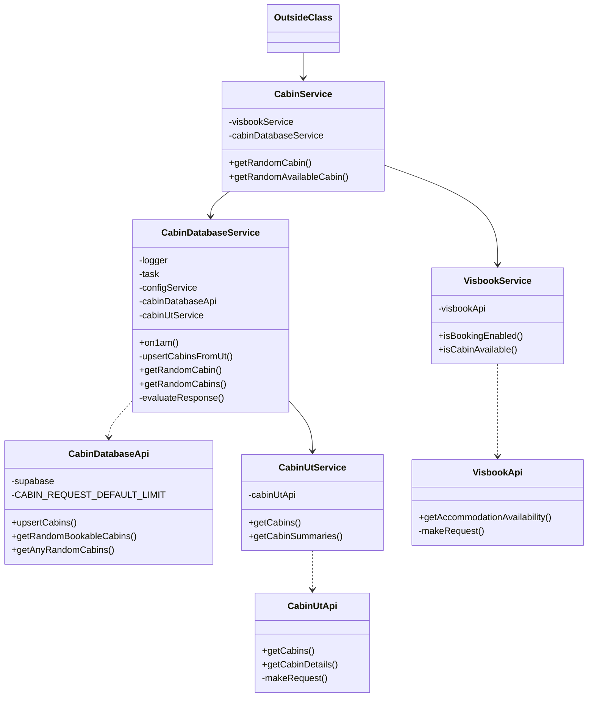

# Cabins

Overview over properties and methods of all cabin related classes. Outside classes should address _CabinService_ in the first place.

```mermaid
classDiagram

OutsideClass --> CabinService
CabinService --> CabinDatabaseService
CabinDatabaseService ..> CabinDatabaseApi
CabinService --> VisbookService
CabinDatabaseService --> CabinUtService
CabinUtService ..> CabinUtApi
VisbookService ..> VisbookApi

class CabinService {
  -visbookService
  -cabinDatabaseService
  +getRandomCabin()
  +getRandomAvailableCabin()
}

class CabinDatabaseService {
  -logger
  -task
  -configService
  -cabinDatabaseApi
  -cabinUtService
  +on1am()
  -upsertCabinsFromUt()
  +getRandomCabin()
  +getRandomCabins()
  -evaluateResponse()
}

class CabinDatabaseApi {
  -supabase
  -CABIN_REQUEST_DEFAULT_LIMIT
  +upsertCabins()
  +getRandomBookableCabins()
  +getAnyRandomCabins()
}

class CabinUtService {
  -cabinUtApi
  +getCabins()
  +getCabinSummaries()
}

class CabinUtApi {
  +getCabins()
  +getCabinDetails()
  -makeRequest()
}

class VisbookService {
  -visbookApi
  +isBookingEnabled()
  +isCabinAvailable()
}

class VisbookApi {
  +getAccommodationAvailability()
  -makeRequest()
}
```
