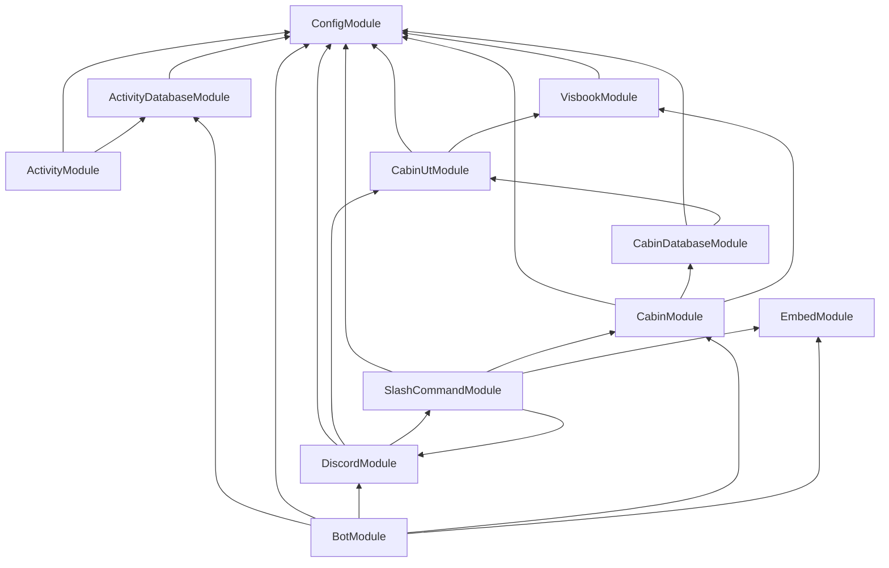

# Modules

Overview over all modules and dependencies.

```mermaid
flowchart BT

ActivityModule --> ConfigModule
ActivityModule --> ActivityDatabaseModule
ActivityDatabaseModule --> ConfigModule
BotModule --> ActivityDatabaseModule
BotModule --> ConfigModule
BotModule --> DiscordModule
BotModule --> CabinModule
BotModule --> EmbedModule
CabinModule --> ConfigModule
CabinModule --> CabinDatabaseModule
CabinModule --> VisbookModule
CabinDatabaseModule --> ConfigModule
CabinDatabaseModule --> CabinUtModule
CabinUtModule --> ConfigModule
CabinUtModule --> VisbookModule
DiscordModule --> ConfigModule
DiscordModule --> CabinUtModule
DiscordModule --> SlashCommandModule
EmbedModule
SlashCommandModule --> ConfigModule
SlashCommandModule --> CabinModule
SlashCommandModule --> DiscordModule
SlashCommandModule --> EmbedModule
VisbookModule --> ConfigModule
```
